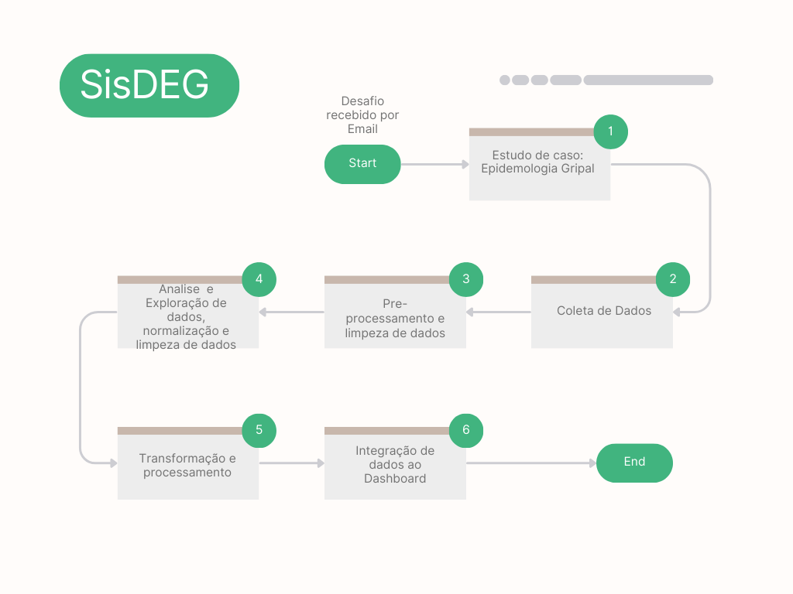

# Projeto de Análise de Síndromes Respiratórias

Este projeto visa criar um protótipo a fim de manipular e analisar dados relacionados a síndromes respiratórias, utilizando tecnologias avançadas de análise e visualização de dados. As principais ferramentas utilizadas incluem:

- **Python**: Linguagem de programação central para manipulação e análise de dados.
- **Pandas**: Biblioteca essencial para manipulação eficiente de dados estruturados.
- **Dash**: Framework para construção de aplicações web interativas em Python.
- **Jupyter Notebooks**: Ambiente interativo para desenvolvimento, visualização e compartilhamento de código.
- **Matplotlib e Seaborn**: Bibliotecas para criação de visualizações gráficas e análise exploratória de dados.

# Fonte de Dados para análise

As fontes de dados fundamentais para este projeto são provenientes do IBGE e OPEN DATA SUS, permitindo uma análise abrangente e detalhada da epidemiologia das síndromes respiratórias no Brasil. O objetivo é gerar insights valiosos que possam contribuir para o entendimento e monitoramento dessas condições de saúde pública.

# Estrutura dos diretorios do projeto

```markdown
```
project-SisDEG/
├── data/
│   ├── # Dados brutos coletados de API e SUS
│   └── # Dados processados e prontos para análise
├── notebooks/
│   └── # Notebooks Jupyter para análise exploratória de dados
├── Documentos/
│   ├── dicionario_de_dados_SRAG_hospitalizado_2019.pdf     # Dicionários de Dados SRAG
│   └── info.txt                                            # Qualquer informação que julgar importante
├── layout/
│   ├── __init__.py        # Inicializador do módulo de dashboard
│   └── layout.py          # Layout e estrutura do dashboard
├── venv/
│   └── # Arquivos relacionados às bibliotecas do ambiente virtual
├── requirements.txt       # Lista de dependências do projeto
├── README.md              # Documentação do projeto
├── app.py                 # Aplicação principal do dashboard
└── .gitignore             # Arquivos e diretórios a serem ignorados pelo Git
```
```

# Fluxograma




1. **Coleta de Dados Brutos:** Obtém dados brutos de fontes como APIs e bases de dados do OPEN DATA SUS.

2. **Pré-processamento e Limpeza de Dados:** Realiza a limpeza inicial, tratamento de valores ausentes, padronização de formatos, etc.

3. **Análise Exploratória de Dados:** Utiliza notebooks Jupyter para explorar os dados, visualizar padrões, identificar insights preliminares.

4. **Processamento e Transformação de Dados:** Aplica transformações mais complexas nos dados conforme necessário para prepará-los para integração no dashboard.

5. **Integração de Dados em Dashboard:** Integra os dados processados no layout do dashboard desenvolvido.

6. **Documentação e Finalização:** Documenta o projeto, incluindo o README.md e outros documentos relevantes.


